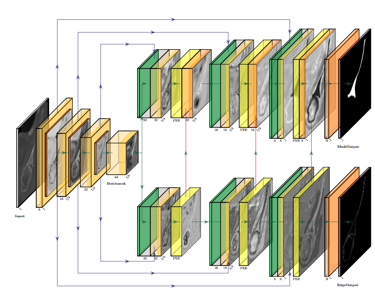
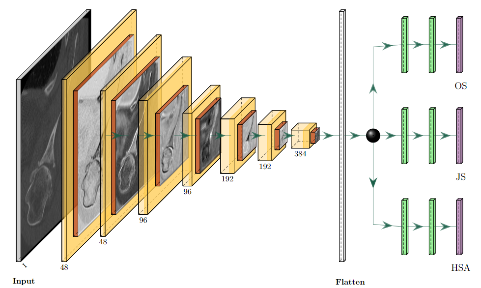

# Cascade Learning in Multi-task Encoder-Decoder Networks

This repository shares the code of two novel convolutional neural networks (CNNs) developed for the article **"Cascade learning in multi-task encoder-decoder networks for concurrent bone segmentation and glenohumeral joint clinical assessment in shoulder CT scans."**

The repository is organized into two main folders:

- **AI-Shoulder/**: Contains the neural network architecture and utility functions.
  - `__init__.py`: Initialization script for package setup.
  - `cnn.py`: Code for the CNN architectures, including both segmentation and classification networks.
  - `utils.py`: Contains helper functions used throughout the codebase (e.g., data preprocessing, metrics computation).
  
- **images/**: Contains images of the two networks used in the article for illustration purposes.

## Repository Structure

```bash
.
├── AI-Shoulder
│   ├── __init__.py
│   ├── cnn.py
│   ├── utils.py
│
├── images
│   ├── CEL-UNet.png
│   ├── Arthro-Net.png
│
├── README.md
├── setup.py
    




